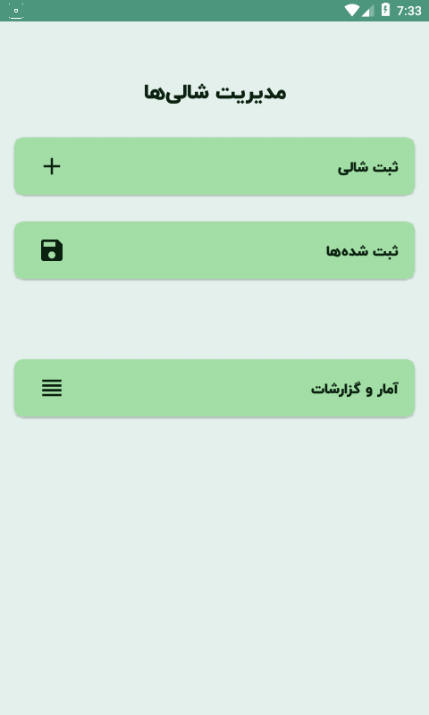
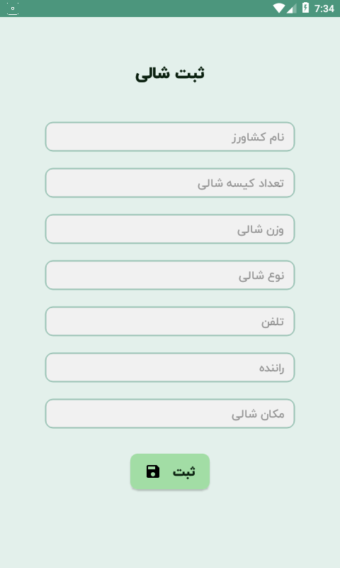
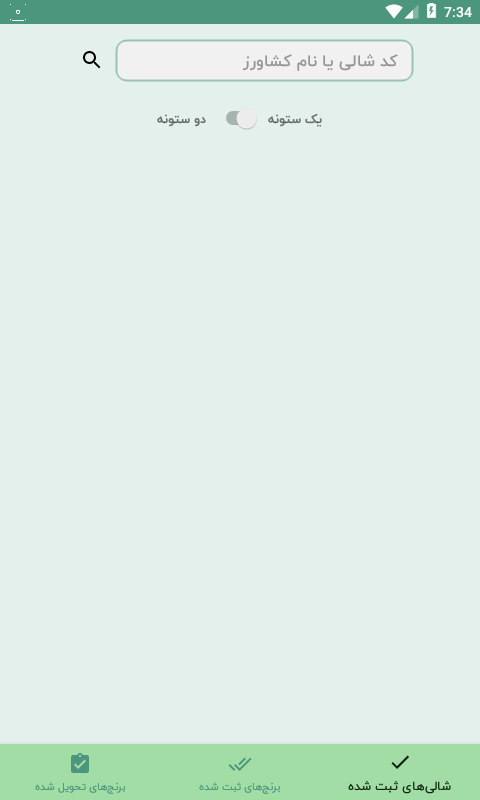
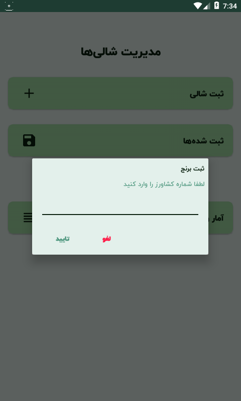

# Shali Management

An Android Application for shali and rice management.

  
   
  
  

## License

MIT

## Font License

IRANYekan fonts are considered a proprietary software. To gain information about the laws regarding the use of these fonts, please visit www.fontiran.com

---

> GitHub [@hosseiniii](https://github.com/hosseiniii) &nbsp;&middot;&nbsp;

